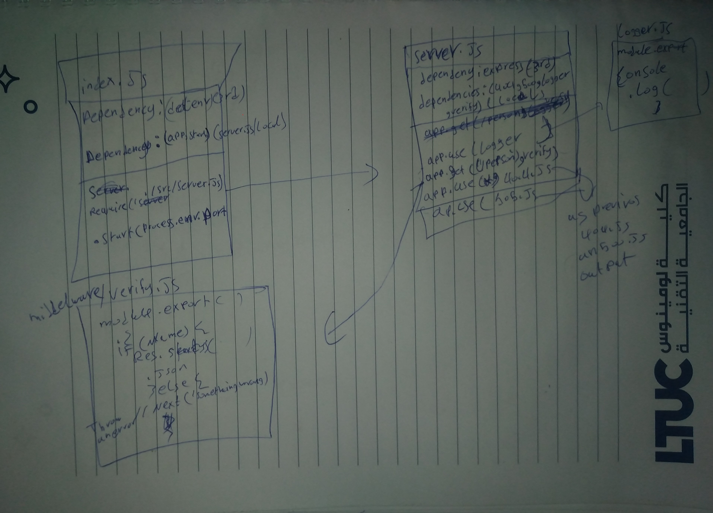

# LAB - 02(basic-express-server

## Deployment Test

### Author: Mohammad Quthama

- [submission PR](https://github.com/tutuorial-401js/class-00)
- [tests report](https://github.com/tutuorial-401js/class-00/actions)
- [dev-deployment](https://mohammad-server-deploy-dev.herokuapp.com)
- [master-deployment](https://mohammad-server-deploy-dev.herokuapp.com)

### Setup

#### `.env` requirements

- `PORT` - 3000

#### Running the app

- `npm start`

- Endpoint: `/person`
  - Returns status(200) & json if (`/person?name=name`)

```JavaScript

    res.status(200).json({
            name:req.query.name
        });

```

- Endpoint: `/person`

  - Returns error 500 if (`/person`)or(`req.query.name` = //falsy value)

#### Tests

- Unit Tests: `npm run test`
  - test for logger.js
  - test for server.js

#### UML


